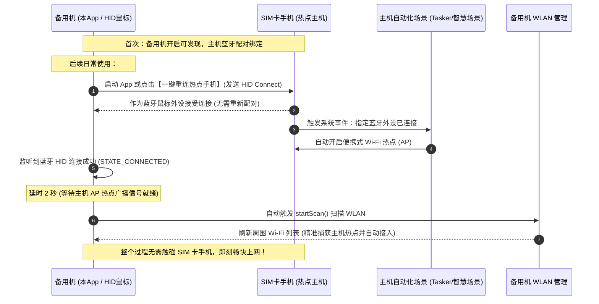

# 热点唤醒 (HotspotWake) - 备用机无感蹭网神器 (蓝牙 HID 鼠标模拟 & 自动热点触发)

> **项目痛点与背景**：
> 一台无 SIM 卡的备用手机需要经常蹭另一台有 SIM 卡手机的网络。常规做法是：每次都要拿出 SIM 卡手机 -> 解锁 -> 手动打开便携式热点 -> 备用机打开 WLAN 寻找热点连接，过程繁琐且割裂。
>
> 即使在 SIM 卡手机上配置了自动化场景（如“检测到备用机蓝牙连接时自动开热点”），但由于 Android 手机间普通蓝牙协议的限制，手机间无法像蓝牙耳机、手环、鼠标那样一开机就自动重新连接通信通道，往往需要重新配对。
>
> **本项目的巧妙解法**：
> 备用机通过 Android 原生 `BluetoothHidDevice` API 将自身**模拟成一个标准蓝牙无线鼠标（HID 外设）**。SIM 卡手机会将其作为外设信任，从而支持开机直接主动重连！连接建立后，主机自动触发规则打开热点，备用机 App 自动刷新并展示 WLAN 列表，实现一气呵成的“无感蹭网”闭环！

---

## 自动化闭环全景图



---

## 核心功能特色

1. **HID 鼠标/外设主动重连 (核心利器)**
   - 突破 Android 手机间普通蓝牙无法自动重连的限制，通过 `BluetoothHidDevice.connect(device)` 对已绑定的 SIM 卡主机发起主动回连。
   - 提供**【绑定/选择热点机】**功能，从已配对设备中一键选择并永久记忆。
   - 支持**【启动 App 时自动重连热点机】**开关，真正做到“打开 App 即可触发热点并刷新网络”。
2. **连接成功 2 秒精准联动刷新 WLAN 列表**
   - 蓝牙连接成功建立后，界面给予动态倒计时反馈，并在 **2 秒后**准时触发 `WifiManager.startScan()` 扫描周围热点。完美规避了主力手机 AP 热点刚打开尚未发射信号的时钟空窗期，大幅提升一次性命中热点的成功率！
   - 列表实时呈现 Wi-Fi 名称、BSSID、信号百分比、2.4G/5G 频段与加密协议。
   - 界面直观调整：WLAN 列表置顶优先展示，下方保留触控板供快捷控制。
3. **真实鼠标与键盘功能测试面板**
   - 内置**触控板 (TouchPad)**：在备用机屏幕滑动手指，SIM 卡手机上会出现真实的鼠标指针并同步位移。
   - 支持单指轻击左键、双指/右下角轻击右键。
   - 常用功能键：回车 (Enter)、返回 (Esc)、主页 (Home)、音量加减等，直观验证外设控制。
4. **CI/CD 自动化持续集成**
   - 集成 GitHub Actions 工作流（[main.yml](.github/workflows/main.yml)），每次 push 或 PR 自动通过 JDK 17 与 Gradle 8.5 编译生成 Debug APK。
   - 支持 打 Tag（v*）自动触发 Release 发布（[release.yml](.github/workflows/release.yml)）。

---

## 目录结构

```
blueWiFi/
├── .github/
│   └── workflows/
│       ├── main.yml                      # CI 自动编译并产出 APK 制品
│       └── release.yml                   # Release 发布流水线
├── app/
│   ├── build.gradle.kts                  # minSdk 28 (Android 9.0+), targetSdk 34
│   └── src/main/
│       ├── AndroidManifest.xml           # 适配 Android 9 ~ 14 完整蓝牙与 WLAN 权限
│       ├── java/com/example/bluewifi/
│       │   ├── MainActivity.kt           # 主控中枢：热点机绑定、自动回连与 WLAN 联动
│       │   ├── hid/
│       │   │   ├── HidConsts.kt          # Combo HID 描述符及标准键码
│       │   │   ├── HidDeviceListener.kt
│       │   │   └── BluetoothHidManager.kt# BluetoothHidDevice 生命周期与报文驱动
│       │   ├── wifi/
│       │   │   ├── WifiItem.kt           # Wi-Fi 实体模型
│       │   │   └── WifiScanManager.kt    # WLAN 扫描、广播监听与系统设置跳转
│       │   └── ui/
│       │       ├── TouchPadView.kt       # 鼠标触控板自定义 View
│       │       └── WifiListAdapter.kt    # WLAN 列表 RecyclerView 适配器
│       └── res/                          # 布局与主题资源
├── gradlew / gradlew.bat                 # Gradle 包装脚本
└── settings.gradle.kts
```

---

## 落地使用指南

### 一、SIM 卡手机设置（一次性）
使用 SIM 卡手机自带的“智慧生活/快捷指令/任务自动化/Tasker”设置一条场景规则：
- **触发条件**：蓝牙连接到指定设备（即运行本 App 的备用机名称）；
- **执行动作**：开启个人热点（便携式 WLAN 热点）。

### 二、备用机初次配对（一次性）
1. 备用机打开本 App，授予蓝牙与定位权限；
2. 点击界面的 **【开启蓝牙可发现模式】**；
3. SIM 卡手机进入蓝牙搜索界面，搜索并与备用机完成首次配对；
4. 配对完成后，在备用机 App 中点击 **【绑定/选择热点机】**，选中该 SIM 卡手机；
5. 可勾选 **【启动 App 时自动重连热点机】**。

### 三、日常使用（极速闭环）
- 备用机打开 App（或点击界面上的 **【一键重连热点手机 (触发热点)】**）；
- 备用机作为鼠标外设主动连上 SIM 卡手机，SIM 卡手机感知到外设连入立刻自动开启热点；
- 备用机感知到连接成功，自动开始就地刷新 WLAN 列表并连接上网！
