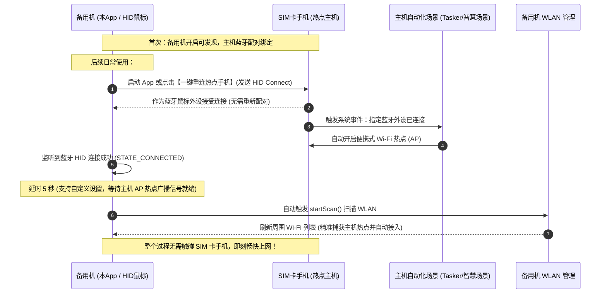

# 热点唤醒 (HotspotWake) - 备用机无感蹭网神器 (蓝牙 HID 鼠标模拟 & 自动热点触发)

> **项目痛点与背景**：
> 一台无 SIM 卡的备用手机需要经常蹭另一台有 SIM 卡手机的网络。常规做法是：每次都要拿出 SIM 卡手机 -> 解锁 -> 手动打开便携式热点 -> 备用机打开 WLAN 寻找热点连接，过程繁琐且割裂。
>
> 即使在 SIM 卡手机上配置了自动化场景（如“检测到备用机蓝牙连接时自动开热点”），但由于 Android 手机间普通蓝牙协议的限制，手机间无法像蓝牙耳机、手环、鼠标那样一开机就自动重新连接通信通道，往往需要重新配对。
>
> **本项目的巧妙解法**：
> 备用机通过 Android 原生 `BluetoothHidDevice` API 将自身**模拟成一个标准蓝牙无线鼠标（HID 外设）**。SIM 卡手机会将其作为外设信任，从而支持开机直接主动重连！连接建立后，主机自动触发规则打开热点，备用机 App 自动刷新并展示 WLAN 列表，实现一气呵成的“无感蹭网”闭环！

---

## 自动化闭环全景图



---

## 核心功能特色

1. **HID 鼠标/外设主动重连 (核心利器)**
   - 突破 Android 手机间普通蓝牙无法自动重连的限制，通过 `BluetoothHidDevice.connect(device)` 对已绑定的 SIM 卡主机发起主动回连。
   - 提供**【绑定/选择热点机】**功能，从已配对设备中一键选择并永久记忆。
   - 支持**【启动 App 时自动重连热点机】**开关，真正做到“打开 App 即可触发热点并刷新网络”。
2. **连接成功联动刷新 WLAN 列表 (默认 5 秒，支持灵活设置)**
   - 蓝牙连接成功建立后，界面给予动态倒计时反馈，并在默认 **5 秒后**准时触发 `WifiManager.startScan()` 扫描周围热点。完美规避了主力手机 AP 热点刚打开尚未发射信号的时钟空窗期，大幅提升一次性命中热点的成功率！
   - **支持自定义刷新延时**：界面提供一键设置，支持根据手机热点开启速度自由调节（1秒/2秒/3秒/5秒/8秒/10秒），适配各种机型。
   - 列表实时呈现 Wi-Fi 名称、BSSID、信号百分比、2.4G/5G 频段与加密协议。
   - 界面直观调整：WLAN 列表置顶优先展示，下方保留触控板供快捷控制。
3. **绑定目标热点 & 自动连接 (Auto Join)**
   - 支持在 WLAN 列表中点击任意 Wi-Fi 将其**一键设为【自动连接目标】**（持久化保存 SSID 与密码）；
   - 列表项同步显示醒目的绿色「自动连接目标」Badge 标签；
   - 下次蓝牙连接成功并在设定的延时（默认 5 秒）扫描出该热点后，App 会**立即自动发起网络连接**，无需任何人工点击，实现真正的“全自动免操作连网”！
4. **真实鼠标与键盘功能测试面板**
   - 内置**触控板 (TouchPad)**：在备用机屏幕滑动手指，SIM 卡手机上会出现真实的鼠标指针并同步位移。
   - 支持单指轻击左键、双指/右下角轻击右键。
   - 常用功能键：回车 (Enter)、返回 (Esc)、主页 (Home)、音量加减等，直观验证外设控制。
5. **后台守护前台服务 & 空闲心跳保活 (防断连自愈)**
   - 适配 Android 14 (targetSdk 34) `connectedDevice` 规范的 `HotspotWakeService` 前台常驻服务与 WakeLock；
   - **HID 报文心跳保活**：连接建立后每 25 秒向主机发送静默心跳报文 (`dx=0, dy=0`)，彻底解决主力机因外设长时间静默而主动断开 L2CAP 链路的节能痛点；
   - **意外断开自动重连 (支持开关设置)**：当受到瞬时干扰或手机短时失联时，后台服务在 3.5 秒内自动发起重新回连；支持在主界面一键开启/关闭该功能；
   - **电池优化白名单引导**：界面直接提供一键申请“忽略电池优化”跳转，杜绝国产系统锁屏冻结应用。
6. **CI/CD 自动化持续集成**
   - 集成 GitHub Actions 工作流（[main.yml](.github/workflows/main.yml)），每次 push 或 PR 自动通过 JDK 17 与 Gradle 8.5 编译生成 Debug APK。
   - 支持 打 Tag（v*）自动触发 Release 发布（[release.yml](.github/workflows/release.yml)）。

---

## 目录结构

```
blueWiFi/
├── .github/
│   └── workflows/
│       ├── main.yml                      # CI 自动编译并产出 APK 制品
│       └── release.yml                   # Release 发布流水线
├── app/
│   ├── build.gradle.kts                  # minSdk 28 (Android 9.0+), targetSdk 34
│   └── src/main/
│       ├── AndroidManifest.xml           # 适配 Android 9 ~ 14 前台服务、蓝牙与 WLAN 权限
│       ├── java/com/example/bluewifi/
│       │   ├── MainActivity.kt           # 主控中枢：热点机绑定、状态同步与 WLAN 联动
│       │   ├── service/
│       │   │   └── HotspotWakeService.kt # 前台守护服务：通知栏常驻、心跳保活、异常自动重连
│       │   ├── hid/
│       │   │   ├── HidConsts.kt          # Combo HID 描述符及标准键码
│       │   │   ├── HidDeviceListener.kt
│       │   │   └── BluetoothHidManager.kt# 单例管理、BluetoothHidDevice 生命周期与报文驱动
│       │   ├── wifi/
│       │   │   ├── WifiItem.kt           # Wi-Fi 实体模型
│       │   │   └── WifiScanManager.kt    # WLAN 扫描、广播监听与系统设置跳转
│       │   └── ui/
│       │       ├── TouchPadView.kt       # 鼠标触控板自定义 View
│       │       └── WifiListAdapter.kt    # WLAN 列表 RecyclerView 适配器
│       └── res/                          # 布局与主题资源
├── gradlew / gradlew.bat                 # Gradle 包装脚本
└── settings.gradle.kts
```

---

## 落地使用指南

### 一、SIM 卡手机设置（一次性）
使用 SIM 卡手机自带的“智慧生活/快捷指令/任务自动化/Tasker”设置一条场景规则：
- **触发条件**：蓝牙连接到指定设备（即运行本 App 的备用机名称）；
- **执行动作**：开启个人热点（便携式 WLAN 热点）。

### 二、备用机初次配对与热点绑定（一次性）
1. 备用机打开本 App，授予蓝牙与定位权限；
2. 点击界面的 **【开启蓝牙可发现模式】**；
3. SIM 卡手机进入蓝牙搜索界面，搜索并与备用机完成首次配对；
4. 配对完成后，在备用机 App 中点击 **【绑定/选择热点机】**，选中该 SIM 卡手机，并勾选 **【启动 App 时自动重连热点机】**；
5. 在下方的 WLAN 列表中点击主力机的 Wi-Fi 热点，点击 **【保存并设为目标】**，绑定为默认自动连接热点。

### 三、日常使用（极速闭环，彻底解放双手）
- **步骤 1**：备用机只需点开 App 图标；
- **步骤 2**：App 自动作为外设鼠标重连 SIM 卡手机，SIM 卡手机感知到外设连入立刻自动打开热点；
- **步骤 3**：备用机检测到蓝牙连上，延时 5 秒（支持设置）自动扫描 WLAN，识别到预设的主力机热点后**自动接入该网络**，立刻畅快上网！
- **全程 0 次手动点击，真正做到点开即上网！**
